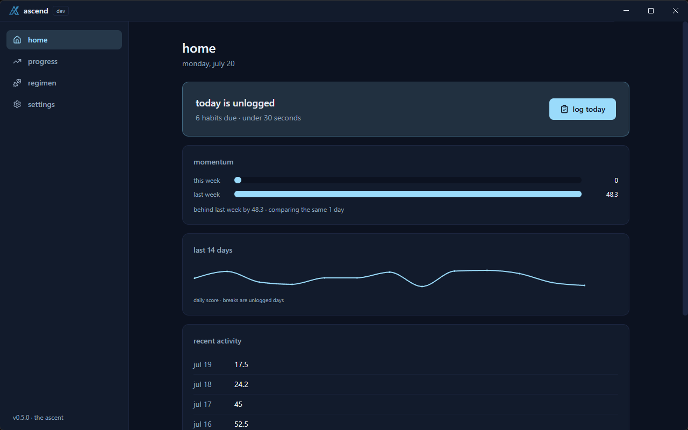
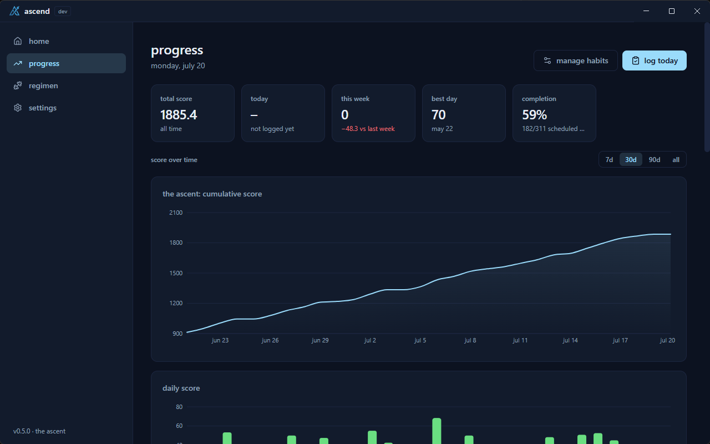
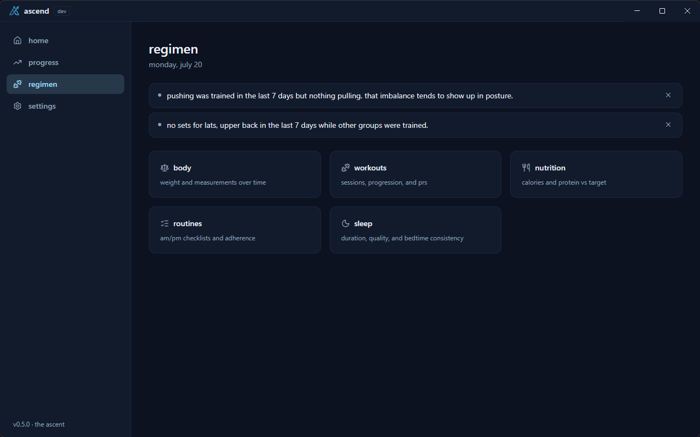
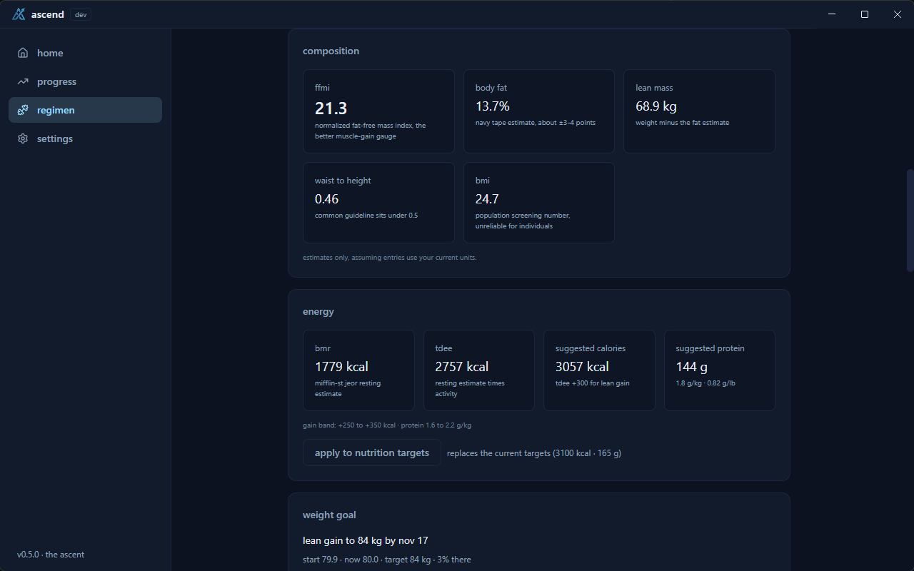
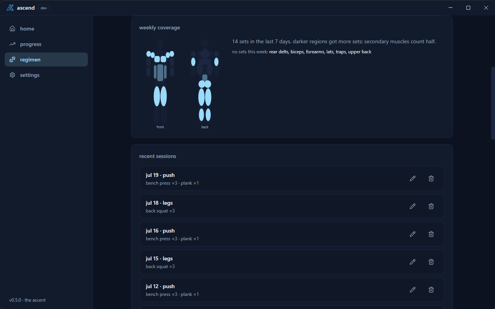
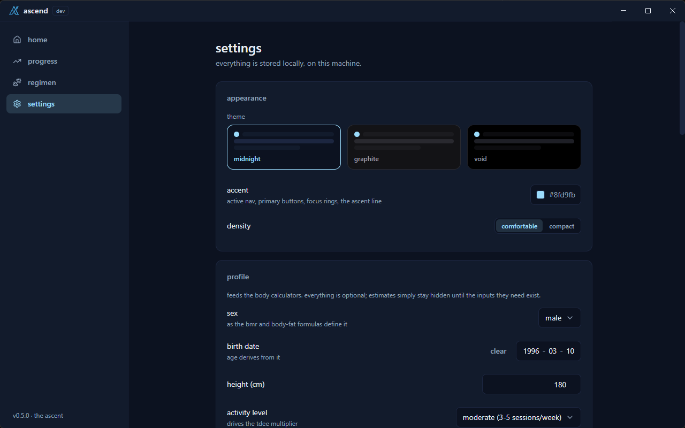

  

<h1 align="center">ascend</h1>

a local-first personal dashboard. the ascent starts here.

  
  

## screenshots

| home | progress |
|---|---|
|  |  |

| regimen | body |
|---|---|
|  |  |

| workouts | settings |
|---|---|
|  |  |

## features

### habits

- weighted habits with per-day schedules: yes/no, quantity, duration, on time, and penalty types
- on time habits log a day as on time, late, or missed, with an optional target time; penalty habits track things to avoid, where a relapse costs the habit's full weight and clean days build a streak
- daily logging in under 30 seconds, with a backfill window for missed days
- a pure scoring engine: optional streak multipliers, penalties for logged misses, partial credit, and effective-dated parameter changes (history is never rescored)
- charts that draw your climb: cumulative ascent line, daily bars, calendar heatmaps with day numbers
- a home screen with momentum vs last week, top streaks, and a 14-day sparkline

### regimen

- body: weight and measurements with a trend chart, plus estimates from an optional profile (resting burn, daily burn, suggested calories and protein, body fat, lean mass, ffmi, bmi, waist-to-height), each labeled with its error range
- weight goals with the rate they need, a projection line, on or behind pace, and a warning when a goal or a suggested intake asks for too much
- workouts: sessions of sets per exercise, progression charts with prs, a muscle map per exercise and session, and weekly coverage shaded by sets
- nutrition: full macros against optional targets, a 7-day rolling average, a macros-vs-calories cross-check, one-click presets for the foods you log often, and a chart of intake against your weight trend
- routines: am and pm checklists with per-step weekday schedules, adherence, streaks, starter templates, check-all with undo, and optional reminders
- sleep: bedtime, wake time, and quality, with a duration chart against your target and a bedtime consistency number
- insights: at most three short observations at a time, dismissible, and silent until there is enough logged data to mean anything

### everywhere

- three dark themes (midnight, graphite, void) and a customizable accent color
- a comfortable/compact density that scales controls, spacing, and charts
- fully keyboard-operable controls throughout
- integrated window chrome: a themed header with a drag region replaces the native title bar
- json export and import, daily startup backups with one-click restore
- archived items can be restored; archived habits can also be deleted forever behind a type-to-confirm step
- an "erase everything" flow behind a type-to-confirm step, with an automatic backup first
- local reminders and launch-at-startup, no network anywhere

## installation

download the latest windows installer from [releases](https://github.com/haitamoudah/ascend/releases) and run it. windows may show a smartscreen prompt for an unsigned installer: choose "more info", then "run anyway".

macos and linux installers are on the roadmap.

## data and privacy

- 100% local: no cloud, no telemetry, no accounts, no network calls
- your data lives in a single sqlite database at `%APPDATA%/ascend/ascend.db`
- a daily snapshot backup is written on launch (newest 7 kept), with extra snapshots before any import, restore, delete, or erase
- full json export and import from settings > data, covering habits, logs, and everything in the regimen
- archiving keeps history: archived habits, exercises, routines, routine steps, and food presets all live in settings > data and can be restored
- exactly two flows hard-delete data, both behind a type-to-confirm step and an automatic backup: "erase everything", and deleting an archived habit forever (which removes its logs and recomputes historical scores)
- the health estimates are computed on your machine from standard formulas and labeled with their error ranges. no food or exercise database is bundled or fetched

## roadmap

- more modules: finance, journal, goals
- macos and linux installers

## support

found a bug or want a feature? [open an issue](https://github.com/haitamoudah/ascend/issues). see the [faq](FAQ.md) for common questions.
